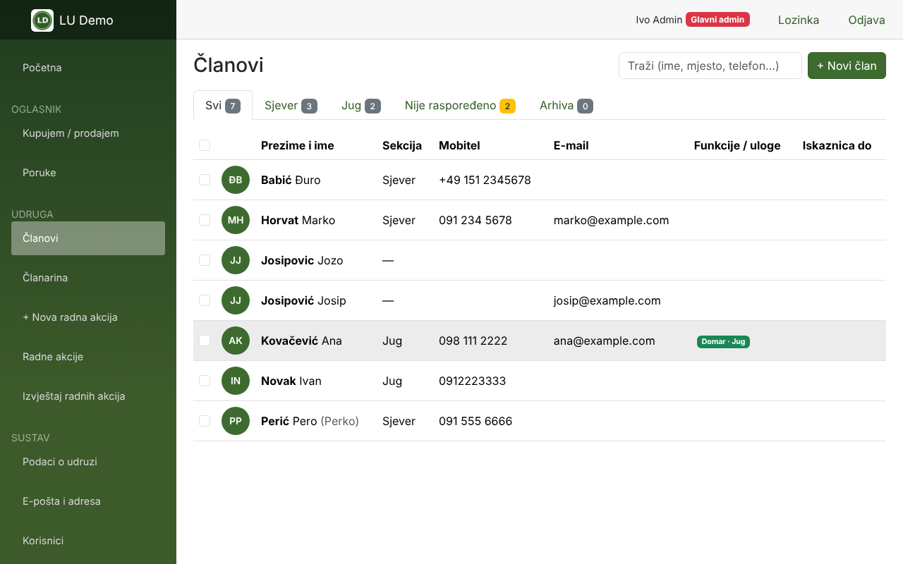
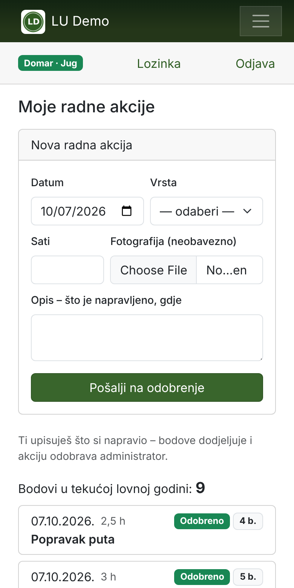

# Lovačka evidencija

**Evidencija članova, radnih akcija, bodova i članarine za lovačke udruge** – web aplikacija za računalo i mobitel.
Radi na običnom PHP webhostingu (bez baze podataka na poslužitelju, bez naredbenog retka): učitate datoteke preko FTP-a i otvorite adresu.

> 🇩🇪 Kurz: Mitglieder-, Arbeitseinsatz- und Beitragsverwaltung für Jagdvereine. PHP 8.1+, SQLite, einfach per FTP auf jeden Webspace hochladen. Oberfläche auf Kroatisch.
> 🇬🇧 Short: membership, work-action points and fee management for hunting associations. PHP 8.1+, SQLite, upload via FTP to any web host. UI in Croatian.

| Administrator | Član na mobitelu |
|---|---|
|  |  |

## Što sve može

**Za administratore udruge**
- **Članovi** – osobni, kontakt i lovački podaci (iskaznica, ispit, diploma), fotografija, funkcije (npr. lovočuvar za određenu jedinicu), arhiva bivših članova
- **Sekcije / lovne jedinice** – međusobno odvojene: administrator jedne sekcije ne vidi drugu
- **Radne akcije i bodovi** – Domar / voditelj radova upiše akciju jednom i označi sve koji su bili; članovi sami prijavljuju akcije (s fotografijom), administrator odobrava i dodjeljuje bodove
- **Izvještaji** – ovaj mjesec, godina, **lovna godina (1.4.–31.3.)**, odabrani mjeseci ili datumi; grupiranje po članu, mjesecu, vrsti, sekciji; ispis, **PDF**, Excel (CSV), slanje e-poštom, „svakom članu njegov izvadak“
- **Kalendar** – termini za cijelu udrugu ili odabrane sekcije (ostali ih ne vide), „dolazim / ne dolazim“, pretplata u kalendar mobitela, radna akcija jednim klikom za sve koji su došli
- **Članarina** – isti iznos za sve, plaćanje jednokratno ili u 1–12 rata (svaka s vlastitim iznosom i datumom), plan po članu, diskretan podsjetnik članu kad rata dospije, pregled dospjelih
- **Poruke članovima** – WhatsApp, Viber, SMS, e-pošta ili kopirani tekst; predlošci se mogu urediti
- **Uvoz iz Google kontakata** – prepoznaje ista imena unatoč č/ć/š/ž/đ, zamijenjenom imenu i prezimenu i tipfelerima; ništa se ne sprema bez potvrde
- **Provjera duplikata** i spajanje dvaju zapisa iste osobe
- **Uloge i prava** – Glavni admin, Predsjednik/Tajnik, Blagajnik, Domar, Admin sekcije… i vlastite uloge
- **Sigurnosne kopije** – dnevna automatska kopija, kompletna kopija (ZIP) za preseljenje
- **Dnevnik promjena** – tko je što promijenio

**Za članove (mobitel)**
- početna stranica: nadolazeći termini, radne akcije, oglasnik, članarina u jednoj liniji
- ikona na početnom zaslonu („Dodaj na početni zaslon“ – Android i iPhone), otvara se kao aplikacija
- vlastiti podaci i fotografija, upis radnih akcija, bodovi u lovnoj godini
- **Imenik** cijele udruge – svaki član sam odlučuje dijeli li mobitel, e-mail, mjesto/adresu; uprava vidi sve; **poruke unutar aplikacije** svakom članu
- **Oglasnik „Kupujem / prodajem“** – oružje, streljivo, optika, pribor, odjeća, psi… sa slikama i porukama među članovima

**Sigurnost**
- pristup putem osobne **pozivnice** ili jedne **zajedničke poveznice za samoprijavu** (npr. u WhatsApp grupi) – uvijek uz **odobrenje administratora**
- lozinke šifrirane (PBKDF2), zaključavanje nakon 5 pogrešnih pokušaja, zaštita od CSRF-a
- arhivirani član automatski gubi pristup

## Zahtjevi

- PHP **8.1** ili noviji s proširenjima `pdo_sqlite`, `mbstring`, `openssl`, `dom`, `zip` (gotovo svaki hosting ih ima)
- preporučeno `gd` (smanjivanje fotografija) i `intl` (hrvatsko abecedno sortiranje)
- Apache (s `.htaccess`) ili nginx (vidi dolje)
- **Nije** potrebna MySQL baza – podaci su u jednoj SQLite datoteci

## Instalacija na webhosting (FTP)

1. Preuzmite aplikaciju: zeleni gumb **Code → Download ZIP** na ovoj stranici (ili ZIP s [Releases](../../releases), ako postoji) – sadrži sve potrebno, uključujući mapu `vendor`.
2. Raspakirajte i preko FTP-a (npr. FileZilla) učitajte cijeli sadržaj u mapu na webspaceu, npr. `public_html/evidencija/`.
3. Mapa `podaci/` mora biti **zapisiva** za PHP (prava 755 ili 775; kod većine hostinga je već u redu).
4. Otvorite `https://vasa-domena.hr/evidencija/` → **Prvo pokretanje**: naziv udruge, sekcije, glavni administrator.
5. Prijavite se → *Sustav → E-pošta i adresa* (neobavezno, za slanje e-pošte i pozivnica) → *Sustav → Uvoz* (Google kontakti) ili ručni unos članova.

**Još jednostavnije:** učitajte samo datoteku [`instaliraj.php`](instaliraj.php) u `public_html/` i otvorite `https://vasa-domena.hr/instaliraj.php` – provjeri poslužitelj, preuzme aplikaciju s GitHuba, raspakira je u mapu `evidencija` i sama se obriše.

Detaljne upute (hrvatski): [INSTALACIJA.md](INSTALACIJA.md)

### Važno: zaštita podataka
Mapa `podaci/` sadrži bazu s osobnim podacima. Na Apacheu je zaštićena datotekom `.htaccess`.
**Na nginxu** `.htaccess` ne vrijedi – dodajte u konfiguraciju:
```nginx
location ~ ^/evidencija/(app|podaci|vendor)/ { deny all; }
```
ili, još bolje, premjestite podatke **izvan javne mape** (kopirajte `config.example.php` u `config.php` i postavite `'podaci' => '/home/korisnik/evidencija-podaci'`).
Aplikacija sama provjerava je li baza javno dostupna i na početnoj stranici upozorava administratora.

## Lokalno na računalu (bez hostinga)
Instaliran PHP 8.1+ → u mapi aplikacije:
```
php -S localhost:8080 ruter.php
```
i otvorite http://localhost:8080

## Preseljenje i kompatibilnost
Baza podataka je **ista kao u Windows i Home Assistant verziji** (ASP.NET). Kompletna kopija (ZIP) iz bilo koje verzije može se vratiti u bilo koju drugu:
*Sustav → Sigurnosne kopije → Preuzmi kompletnu kopiju (ZIP)* → na novom mjestu kod prvog pokretanja *Vrati iz kompletne kopije*.
(Lozinku e-pošte nakon preseljenja iz Windows/HA verzije treba jednom ponovno upisati.)

## Za programere
- bez okvira (frameworka): `index.php` → `app/stranice/<stranica>.php`, pomoćne funkcije u `app/lib/`, predlošci u `app/predlosci/`
- baza: `app/shema.sql` (identična EF Core migracijama .NET verzije)
- ovisnosti (Composer): PHPMailer, Dompdf – mapa `vendor/` je u repozitoriju zbog FTP instalacije
- pull requestovi su dobrodošli

## Licenca
[MIT](LICENSE) – slobodno za korištenje, mijenjanje i dijeljenje, i za druge udruge.
Udruga koja koristi aplikaciju odgovorna je za zakonitu obradu osobnih podataka svojih članova (GDPR).
